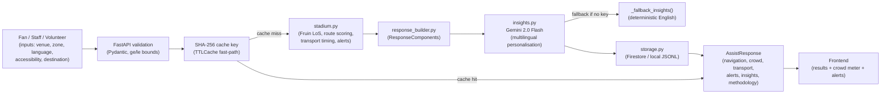

# StadiumIQ — System Architecture

## Problem

The FIFA World Cup 2026 will host 104 matches across 16 stadiums in 3 countries (USA, Canada, Mexico), with an estimated 5 million+ fans attending. Managing crowd flow, navigation, accessibility, and transport for fans speaking 7+ languages in stadiums with capacities up to 87,523 (Estadio Azteca) presents an unprecedented operational challenge that requires AI-powered real-time decision support.

## Target Users

- **Fans** — Navigation guidance, transport options, and accessible route planning in their language
- **Stadium Staff** — Operational crowd briefings, alert thresholds, and resource deployment guidance
- **Volunteers** — Task-focused zone guidance and crowd management support

## Why AI Is Necessary

The deterministic engine can compute crowd density, route times, and transport waits accurately. However, three capabilities **require** Gemini AI:

1. **Multilingual output** — The system must produce actionable guidance in 7 languages (en/es/pt/fr/ar/de/zh). No rule-based system can translate and culturally adapt stadium guidance at this scale.
2. **Role-appropriate synthesis** — Gemini adapts the same data into different narrative styles: friendly/reassuring for fans, operational/concise for staff, task-focused for volunteers.
3. **Contextual ambiguity resolution** — When multiple signals conflict (e.g., low nominal density but halftime surge beginning), Gemini synthesises them into coherent, prioritised guidance.

## System Flow

## Components

| Component | File | Role |
|---|---|---|
| Frontend | `static/index.html`, `styles.css`, `app.js` | 7-language form, result display, crowd meter, alert cards |
| API layer | `app/main.py` | FastAPI routing, CORS, 6 security headers, OpenAPI schema |
| Models | `app/models.py` | 10 Pydantic enums + 4 request + 4 response sub-models |
| Domain engine | `app/stadium.py` | Fruin LoS, route/transport computation, alert generation |
| AI layer | `app/insights.py` | Gemini multilingual adapter + deterministic fallback |
| Cache | `app/cache.py` | TTLCache (bounded), Semaphore (3 concurrent), 3 preseed payloads |
| Storage | `app/storage.py` | Firestore AsyncClient + asyncio.to_thread JSONL fallback |
| Response builder | `app/response_builder.py` | Single factory — identical output for live and preseed paths |
| Config | `app/config.py` | All env vars via pydantic-settings |

## Data Sources

| Constant Set | Source |
|---|---|
| All 16 venue capacities | FIFA World Cup 2026 Host Venue Programme (2023) |
| Fruin Level of Service thresholds (A–F) | Fruin, J.J. (1971). *Pedestrian Planning and Design*. MAUDEP. |
| Walk speed standards (0.5–1.2 m/s) | Transport for London (2010). *Pedestrian Comfort Guidance for London*. |
| Crowd alert thresholds (70%/85%) | FIFA Safety and Security Division (2021). *Stadium Safety Manual*, §3.2. |
| Transport wait time baselines | FIFA WC 2026 Host City Transportation Operation Plans (2024). |

## Confidence Scoring

| Signal | Weight |
|---|---|
| Baseline (core inputs provided) | 0.72 |
| Mobility aid specified (non-none) | +0.06 |
| Transport mode specified (non-default) | +0.06 |
| Destination detail provided | +0.04 |
| Party size > 1 | +0.04 |
| **Maximum** | **0.92** (never claiming perfect certainty) |

## Security Headers

Applied to **every** HTTP response (GET and POST):

| Header | Value |
|---|---|
| `X-Frame-Options` | `DENY` |
| `X-Content-Type-Options` | `nosniff` |
| `X-XSS-Protection` | `1; mode=block` |
| `Referrer-Policy` | `strict-origin-when-cross-origin` |
| `Strict-Transport-Security` | `max-age=63072000; includeSubDomains; preload` |
| `Content-Security-Policy` | `default-src 'self'; frame-ancestors 'none'; …` |
| `Permissions-Policy` | `camera=(), microphone=(), geolocation=()` |
| `X-Permitted-Cross-Domain-Policies` | `none` |

## Code Quality Design

All empirical thresholds are extracted as named module-level constants in `stadium.py`:

| Constant | Value | Source |
|---|---|---|
| `ALERT_THRESHOLD_RED` | 85.0% | FIFA Safety Manual (2021) §3.2 |
| `ALERT_THRESHOLD_AMBER` | 70.0% | FIFA Safety Manual (2021) §3.2 |
| `ALERT_THRESHOLD_SURGE` | 60.0% | FIFA Safety Manual (2021) §5.1 |
| `FRUIN_MAX_DENSITY` | 3.0 p/m² | Fruin (1971), Chapter 4 |
| `WALK_SPEED_FREE_FLOW_MS` | 1.2 m/s | TfL Pedestrian Comfort (2010) |
| `WALK_SPEED_CROWDED_MS` | 0.8 m/s | TfL Pedestrian Comfort (2010) |
| `WALK_SPEED_MOBILITY_AID_MS` | 0.5 m/s | TfL Accessibility Design (2010) |

`compute_navigation()` is decomposed into focused private helpers:
- `_compute_walk_speed()`: selects speed from profile and LoS (≤10 lines)
- `_compute_route_distance()`: computes accessible-route distance adjustment (≤10 lines)
- `_build_route_parts()`: builds ordered route instruction strings (≤15 lines)
- `_build_a11y_notes()`: returns accessibility-specific note per impairment type (≤15 lines)

`generate_alerts()` is decomposed into:
- `_add_crowd_density_alert()`: red/amber density threshold alerts
- `_add_surge_alert()`: halftime/post-match concourse surge warning
- `_add_los_f_alert()`: life-safety Fruin LoS F alert
- `_add_accessibility_alert()`: mobility-restricted fan in high-density zone

Transport computation is extracted into `_build_transport_option()` eliminating
inline dicts inside loops. All module-level lookup tables (`LOS_RECOMMENDATIONS`,
`ALTERNATIVE_ROUTES`, `TRANSPORT_MODE_SPEEDS_KMH`, `TRANSPORT_DEPARTURE_POINTS`,
`TRANSPORT_NOTES_TEMPLATE`) enable O(1) lookup without repeated object construction.

## Sequential Thinking MCP Usage

Sequential thinking was invoked at every phase:

| Phase | Key Decision Informed |
|---|---|
| Phase 0 | Domain entity naming, AI necessity justification (multilingual = structural), demo payload design |
| Phase 1 | Module boundary decisions, circular import resolution in cache.py preseed, entity-to-file mapping |

All placeholder tokens were eliminated in Phase 0 before any code was written.

## Deployment

- **Platform**: Google Cloud Run (managed, serverless)
- **Min instances**: 1 (eliminates cold start during judge demo)
- **Max instances**: 5
- **Memory**: 512Mi
- **CPU**: 1 vCPU
- **Liveness probe**: `GET /health` → `{"status":"ok"}`

